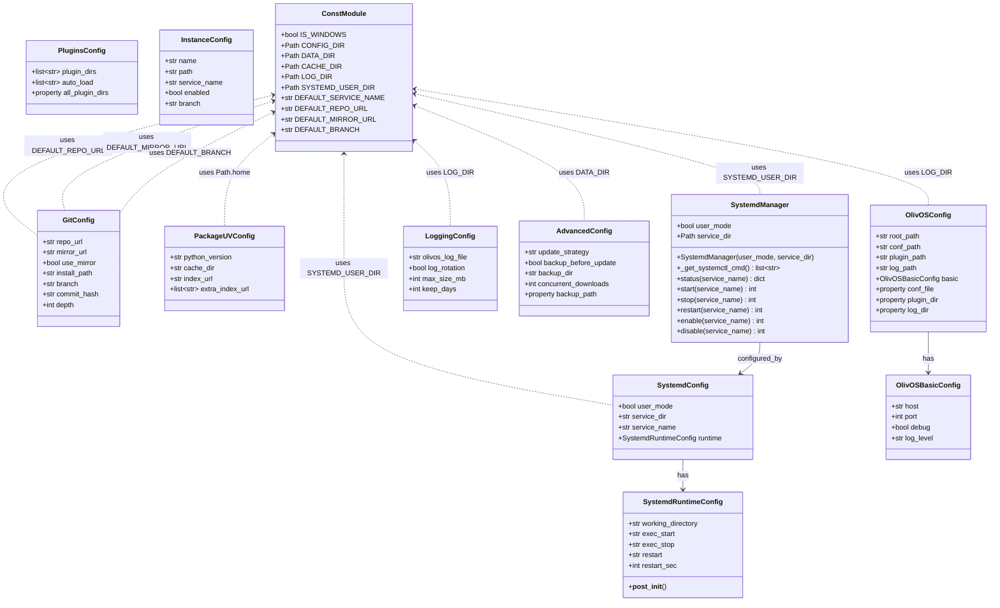

# OlivOS-CLI

> 适用于 OlivOS 框架的命令行管理工具 - 简化部署、配置与管理

[](https://www.python.org/downloads/)
[](https://github.com/psf/black)
[](./LICENSE)



## 特性

- **一键部署** - 自动克隆 OlivOS 仓库、创建虚拟环境并安装依赖
- **多包管理器支持** - 支持 uv、pip、pdm、poetry、rye 等主流包管理器
- **智能配置** - 从 OlivOS accountMetaData 读取预配置模板，支持 60+ 账号类型
- **systemd 集成** - 自动生成和管理 systemd 用户服务
- **实时监控** - 日志查看、状态监控、健康检查
- **版本管理** - Git 分支切换、更新、镜像源加速
- **虚拟环境隔离** - 每个实例独立的 Python 环境


## 安装

### 使用 pip 安装

```bash
pip install olivos-cli
```

### 使用 uv 安装（推荐）

```bash
uvx olivos-cli
```

### 从源码安装

```bash
git clone https://github.com/HsiangNianian/olivos-cli.git
cd olivos-cli
pip install -e .
```

## 快速开始

### 1. 初始化 OlivOS

```bash
olivoscli init
```

这将自动：
- 克隆 OlivOS 仓库到 `~/.local/share/olivos`
- 创建独立的 Python 虚拟环境 (`.venv`)
- 在虚拟环境中安装 Python 依赖
- 创建必要的配置目录

#### 自定义安装选项

```bash
# 指定安装路径
olivos-cli init --path ~/my-olivos

# 使用镜像源加速
olivos-cli init --mirror

# 指定分支
olivos-cli init --branch develop

# 使用特定包管理器
olivos-cli init --package-manager uv

# 跳过依赖安装（手动安装）
olivos-cli init --no-deps
```

### 2. 添加账号

```bash
olivos-cli account add
```

交互式选择平台和账号类型，然后填写账号信息。

#### 非交互模式添加

```bash
# 添加 OneBot 账号
olivos-cli account add \
  --adapter onebotV11 \
  --id 1234567890 \
  --host 127.0.0.1 \
  --port 5700 \
  --access_token your_token
```

### 3. 安装并启动服务

```bash
# 安装 systemd 服务
olivos-cli service install

# 启用开机自启
olivos-cli service enable

# 启动服务
olivos-cli service start

# 查看状态
olivos-cli service status
```

## 命令参考

### 命令缩写

所有命令都支持缩写形式：

| 完整命令 | 缩写 | 说明 |
|:---------|:-----|:-----|
| `olivos-cli init` | `olivos-cli i` | 初始化安装 |
| `olivos-cli git` | `olivos-cli g` | Git 管理 |
| `olivos-cli git pull` | `olivos-cli g up` | 拉取更新 |
| `olivos-cli git checkout` | `olivos-cli g co` | 切换分支 |
| `olivos-cli package` | `olivos-cli p` / `pkg` | 包管理 |
| `olivos-cli service` | `olivos-cli s` / `svc` | 服务管理 |
| `olivos-cli service restart` | `olivos-cli s r` | 重启服务 |
| `olivos-cli adapter` | `olivos-cli a` / `adapt` | 适配器管理 |
| `olivos-cli account` | `olivos-cli acc` | 账号管理 |
| `olivos-cli config` | `olivos-cli c` / `cfg` | 配置管理 |
| `olivos-cli logs` | `olivos-cli log` | 日志查看 |
| `olivos-cli status` | `olivos-cli st` | 状态监控 |

**注意**：你也可以使用 `olivoscli` 作为命令（不带连字符）。

---

### init - 初始化安装

```bash
olivos-cli init [OPTIONS]
```

| 选项 | 说明 |
|:-----|:-----|
| `--path <PATH>` | 安装路径 (默认: ~/.local/share/olivos) |
| `--branch <NAME>` | Git 分支 (默认: main) |
| `--mirror` | 使用镜像源加速 |
| `--minimal` | 最小化安装（仅核心依赖）|
| `--no-deps` | 跳过依赖安装 |
| `--package-manager <NAME>` | 包管理器 (uv/pip/pdm/poetry/rye) |
| `--requirements <FILE>` | 指定依赖文件 |

---

### git - Git 仓库管理

```bash
olivos-cli git <ACTION>
```

| 动作 | 缩写 | 说明 |
|:-----|:-----|:-----|
| `clone` | - | 克隆 OlivOS 仓库 |
| `pull` | `up` | 拉取最新更新 |
| `checkout` | `co` | 切换分支或提交 |
| `status` | `st` | 查看仓库状态 |

```bash
# 克隆指定分支
olivos-cli git clone --branch develop

# 拉取更新
olivos-cli git pull

# 切换到 develop 分支
olivos-cli git checkout develop

# 切换到指定提交
olivos-cli git checkout abc1234

# 查看状态
olivos-cli git status
```

---

### package - Python 包管理

```bash
olivos-cli package <ACTION>
```

| 动作 | 缩写 | 说明 |
|:-----|:-----|:-----|
| `install` | `i` | 安装依赖 |
| `update` | `up` | 更新依赖 |
| `list` | `ls` | 列出已安装的包 |

```bash
# 安装全部依赖
olivos-cli package install

# 安装指定包
olivos-cli package install requests

# 更新所有依赖
olivos-cli package update

# 列出已安装的包
olivos-cli package list
```

---

### service - systemd 服务管理

```bash
olivos-cli service <ACTION>
```

| 动作 | 说明 |
|:-----|:-----|
| `install` | 安装 systemd 服务 |
| `uninstall` | 卸载服务 |
| `enable` | 启用开机自启 |
| `disable` | 禁用开机自启 |
| `start` | 启动服务 |
| `stop` | 停止服务 |
| `restart` / `r` | 重启服务 |
| `status` / `st` | 查看服务状态 |
| `logs` / `log` | 查看服务日志 |

```bash
# 安装服务
olivos-cli service install

# 启用并启动
olivos-cli service enable
olivos-cli service start

# 查看状态
olivos-cli service status

# 实时查看日志
olivos-cli service logs -f

# 重启服务
olivos-cli service restart
```

---

### account - 账号管理

```bash
olivos-cli account <ACTION>
```

| 动作 | 缩写 | 说明 |
|:-----|:-----|:-----|
| `list` | `ls` | 列出所有账号 |
| `add` | - | 添加账号 |
| `remove` | `rm` | 删除账号 |
| `show` | - | 显示账号详情 |

```bash
# 交互式添加账号（推荐）
olivos-cli account add

# 查看所有账号
olivos-cli account list

# 查看账号详情
olivos-cli account show 123456

# 删除账号
olivos-cli account remove 123456
```

**非交互模式选项：**

```bash
olivos-cli account add \
  --adapter onebotV11 \
  --id 1234567890 \
  --token your_password \
  --host 127.0.0.1 \
  --port 5700 \
  --access_token your_token
```

---

### adapter - 适配器管理

```bash
olivos-cli adapter <ACTION>
```

| 动作 | 缩写 | 说明 |
|:-----|:-----|:-----|
| `list` | `ls` | 列出支持的适配器 |
| `enable <NAME>` | - | 启用适配器 |
| `disable <NAME>` | - | 禁用适配器 |
| `config` | `cfg` | 配置适配器 |

```bash
# 列出所有适配器
olivos-cli adapter list

# 配置适配器
olivos-cli adapter config onebotV11 --get host
olivos-cli adapter config onebotV11 --set "host=127.0.0.1"
```

---

### config - 配置管理

```bash
olivos-cli config <ACTION>
```

| 动作 | 说明 |
|:-----|:-----|
| `show` | 显示完整配置 |
| `get <KEY>` | 获取配置项（支持点号路径）|
| `set <KEY> <VALUE>` | 设置配置项 |
| `unset <KEY>` | 删除配置项 |
| `edit` | 编辑配置文件 |
| `reset` | 重置为默认配置 |

```bash
# 显示配置
olivos-cli config show

# 获取配置项
olivos-cli config get git.branch

# 设置配置项
olivos-cli config set git.use_mirror true
olivos-cli config set package.manager uv

# 编辑配置文件
olivos-cli config edit
```

---

### logs - 日志查看

```bash
olivos-cli logs [OPTIONS]
```

| 选项 | 缩写 | 说明 |
|:-----|:-----|:-----|
| `--lines <N>` | `-n` | 显示行数 (默认: 100) |
| `--follow` | `-f` | 实时跟踪日志 |
| `--pattern <PATTERN>` | - | 过滤包含特定模式的行 |
| `--cli` | - | 查看 CLI 工具日志而非 OlivOS 日志 |

```bash
# 查看最近 100 行日志
olivos-cli logs

# 实时跟踪
olivos-cli logs -f

# 查看最近 500 行
olivos-cli logs -n 500

# 过滤包含 "ERROR" 的行
olivos-cli logs --pattern ERROR
```

---

### status - 状态监控

```bash
olivos-cli status [OPTIONS]
```

| 选项 | 缩写 | 说明 |
|:-----|:-----|:-----|
| `--health` | - | 执行健康检查 |
| `--watch` | `-w` | 实时监控模式 |

```bash
# 查看状态
olivos-cli status

# 健康检查
olivos-cli status --health

# 实时监控
olivos-cli status -w
```

---

### run - 直接运行

```bash
olivos-cli run [OPTIONS]
```

| 选项 | 说明 |
|:-----|:-----|
| `--dev` | 开发模式 |
| `--debug` | 调试模式 |

```bash
# 前台运行 OlivOS
olivos-cli run

# 开发模式
olivos-cli run --dev
```

---

### update - 更新 OlivOS-CLI

```bash
olivos-cli update
```

更新 olivos-cli 自身到最新版本。

---

## 配置文件

配置文件位于 `~/.config/olivos-cli/config.toml`：

```toml
[cli]
verbose = false          # 详细输出
log_level = "INFO"       # 日志级别: DEBUG/INFO/WARNING/ERROR

[git]
repo_url = "https://github.com/OlivOS-Team/OlivOS.git"
mirror_url = "https://ghfast.top/https://github.com/OlivOS-Team/OlivOS.git"
use_mirror = false       # 是否使用镜像源
install_path = "~/.local/share/olivos"
branch = "main"          # 默认分支
depth = 1                # 克隆深度

[package]
manager = "uv"           # 包管理器: uv/pip/pdm/poetry/rye
auto_install = true       # 自动安装包管理器

[package.uv]
python_version = "3.11"   # uv 使用的 Python 版本
index_url = "https://mirrors.tuna.tsinghua.edu.cn/pypi/web/simple"

[systemd]
user_mode = true         # 用户模式服务
service_dir = "~/.config/systemd/user"
service_name = "olivos-cli"

[olivos]
root_path = "~/.local/share/olivos"
```

## 故障排除

### 依赖安装失败

**问题**：Pillow 安装失败

**解决方案**：

```bash
# 方案 1：使用系统 Pillow
sudo pacman -S python-pillow  # Arch Linux
sudo apt install python3-pil  # Ubuntu/Debian

# 方案 2：跳过依赖安装
olivos-cli init --no-deps
cd OlivOS
.venv/bin/pip install -r requirements310.txt
```

### 服务启动失败

**问题**：systemd 服务无法启动

**解决方案**：

```bash
# 查看详细日志
olivos-cli service logs --systemd -f

# 检查配置
olivos-cli service status

# 手动运行测试
olivos-cli run --debug
```

### 账号配置无效

**问题**：添加账号后无法连接

**解决方案**：

```bash
# 查看账号详情
olivos-cli account show YOUR_ACCOUNT_ID

# 检查 OlivOS 日志
olivos-cli logs -f
```

## 贡献

欢迎贡献代码！请遵循以下步骤：

1. Fork 本仓库
2. 创建特性分支 (`git checkout -b feature/AmazingFeature`)
3. 提交更改 (`git commit -m 'Add some AmazingFeature'`)
4. 推送到分支 (`git push origin feature/AmazingFeature`)
5. 开启 Pull Request

## 许可证

本项目采用 AGPLv3 协议开源。详见 [LICENSE](./LICENSE) 文件。

## 相关链接

- [OlivOS 官方仓库](https://github.com/OlivOS-Team/OlivOS)
- [OlivOS 文档](https://doc.olivos.wiki/)
- [OlivOS 论坛](https://forum.olivos.run/)
